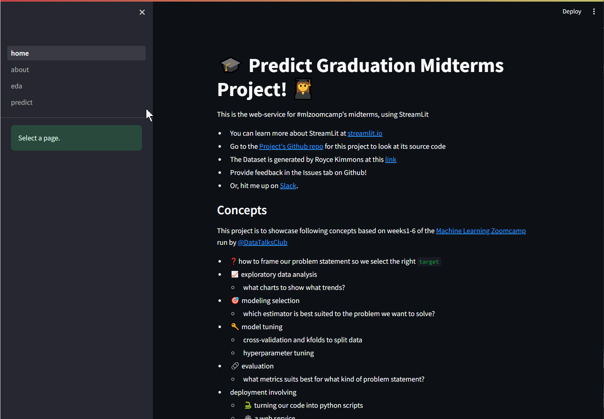

# Ella Sahnan

## Hello, world.

I'm Ella (aka Wati).

I've always like puzzles and games that include some logic element to them. I tend to gravitate towards the technical support side of things in any community I'm a part of. I guess it is the natural Educator in me.

I'm a note-taker and I like to solve problems. 
I take notes on everything and have always documented things, as I'm never without a notebook or a book to read. 

It seems natural to me that I'm in the Data world. But circumstances has not been kind. So, here I am starting over and learning everything Data since 2017. Since I've become more engaged in my learning and in the communities, my learning has skyrocketed in these last 2 years (from mid-2022, depending on when you read this). I've completed **Machine Learning** courses, **Deep Learning** courses and now learning **Data Engineering**. I have also a few projects under my belt. Check them out!

Although a few of them is not Data-related, it just goes to show I can learn **anything**!

## Tech stack

The techonologies that I've learnt over the years. Some I've used for many years, some I just learned this week, with more being added all the time.

                                                                                                                  

## Projects

A few notable projects that I've done. More are still in work-in-progress, or in a course's private organization's repos that I've yet to replicate using a public dataset.

| Machine Learning | Modding  |
|:---------------: |:--------:|
|    |   |

## Work Experience

### 2006 – present, Household Management Officer
- Providing technical support for fellow students while learning Data Engineering, Data Science, Machine Learning, Deep Learning with tools and libraries like  Python, dlthub, dbt labs, Mage AI,  Docker, Terraform, Google Cloud Platform services &  Amazon Web Services, Looker Studio, PySpark, Kafka, Tensorflow, Keras, fastai, and more for Zoomcamp and Heicoders cohorts
- Develop mods for games and tools using  Python, Blender,  Unity and C# and more – see  ellacharmed blog site, for The Sims game and  Steam Workshop for Surviving the Aftermath. 
- Volunteer alpha and beta tester with 3 Indie Studios to provide feedback on features and user-experiences for the past 4 years
- Provide game, modding and remote technical support in the community Forums,  Discord &  Slack chats for games developed & produced by Indie Studios and Electronics Arts (The Sims) for the past 14 years

### All Eights (S) Pte Ltd

2017 – 2018, Business Analyst

- (BI) Led initiative to digitize operations to streamline all *siloed* systems to facilitate easier, more timely and accurate data collection and analysis for **Sales Analytics Dashboards**

2016 – 2018, Data Protection Officer
- (DPO) Ensured compliance to **PDPA** policies

07/2015 – 2018, IT, Marketing & Admin Executive; 
- (IT) Managed software and hardware acquisitions and provided technical support
- (Marketing) Organized new product launchers and seminars
- (Admin) Gatekeeper of communications, created quotations and coordinated Tender submissions between Management, Sales, Engineering, **Regulatory**, Finance and Operations Departments

### Celestica Electronics (S) Pte Ltd

07/2005 – 05/2007, Business Analyst

05/2003 – 05/2007, IT Application Analyst

- Led EDI onboarding projects between Asia Business Units and global partners and improved project completion by **90%**. 
- Managed requirements gathering & gap analysis, developed EDI mapping, developed test plans, conducted UAT and rollout. 
- Provided **Tier3 support** for **ticket resolution** of EDI issues with EDI partners and support vendors.

### Hewlett-Packard (S) Pte Ltd (c/o IM&P Services Pte Ltd)
05/2000 – 03/2003, IT Support Specialist
    
- Provided **Tier 1 Data Warehouse** (inclusive of data extraction and ETL), EDI and ERP monitoring systems support using Follow-The-Sun support model
- Provided **Tier 1 – Tier 3 EDI support** and project rollout in Asia region
- Coordinated **EDI data migration** projects; onboarding projects between Asia Business Units and global partners. 

##### Credits

Thumbnails are ai-generated by Bing CoPilot.

*Icons and logos are the property of their respective trademarks / copyright holders, no copyright infringement intended.* 
- [source for logos](https://github.com/marwin1991/profile-technology-icons)
- [fontawesome icons](https://fontawesome.com/search)
